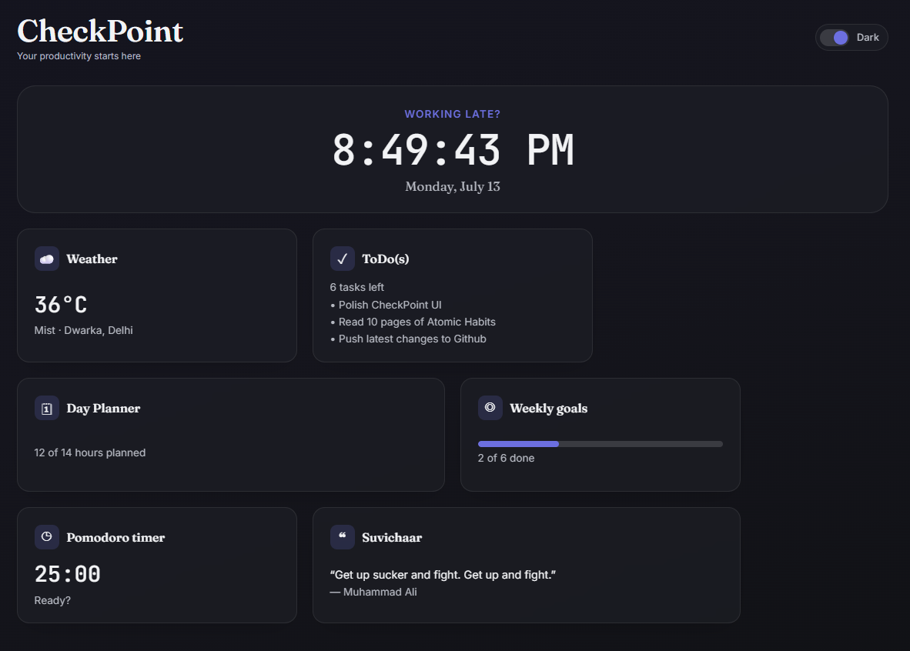

# CheckPoint

> *Your productivity starts here.*

CheckPoint is a modern productivity dashboard built with **HTML, CSS, and JavaScript** that brings together the tools you use every day into one clean, distraction-free interface. Plan your day, manage tasks, track weekly goals, stay focused with a customizable Pomodoro timer, get inspired with daily quotes, and check the weather—all without leaving the dashboard.

## Preview
<p align="center">
  
</p>

## 🚀 Live Demo

<p align="center">
  <a href="https://checkpoint-dashboard-js.vercel.app/"><strong>Visit CheckPoint</strong></a>
</p>


## Features

### Dashboard
- Live clock with dynamic greeting
- Time-based background theme
- Responsive dashboard layout
- Quick access to every productivity tool

### Tasks
- Create, complete, and delete tasks
- Mark important tasks
- Filter by Active, Completed, and Important
- Automatically saved using Local Storage

### Day Planner
- Plan your schedule from 9 AM – 11 PM
- Hourly planning with instant autosave
- Highlights the current hour
- Clear individual time slots

### Weekly Goals
- Create and manage weekly goals
- Track completion with a progress bar
- Monitor your weekly progress at a glance

### Focus Zone
- Customizable Pomodoro timer
- Adjustable work and break durations
- Browser notifications
- Audio alerts when sessions end

### Suvichaar
- Random motivational quotes
- Refresh for a new quote anytime
- Offline fallback quotes when the API is unavailable

### Weather
- Current weather based on your location
- Temperature, humidity, and wind speed
- Automatic fallback location when location access is unavailable

### Personalization
- Light & Dark themes
- Theme preference is remembered
- Responsive across desktop, tablet, and mobile devices


## Tech Stack

- HTML5
- CSS3
- Vanilla JavaScript
- Local Storage
- WeatherAPI
- DummyJSON Quotes API


## Project Structure

```text
Checkpoint/
│
├── assets/
├── index.html
├── style.css
├── app.js
├── preview.png
└── README.md
```


## Future Improvements

- Drag-and-drop task reordering
- Calendar view for the day planner
- Recurring tasks and weekly goals
- Task categories and color labels
- Custom dashboard themes
- Focus session history and productivity insights
- Export and import user data
- Keyboard shortcuts for faster navigation
- Custom reminder notifications
- Cloud sync for accessing data across devices